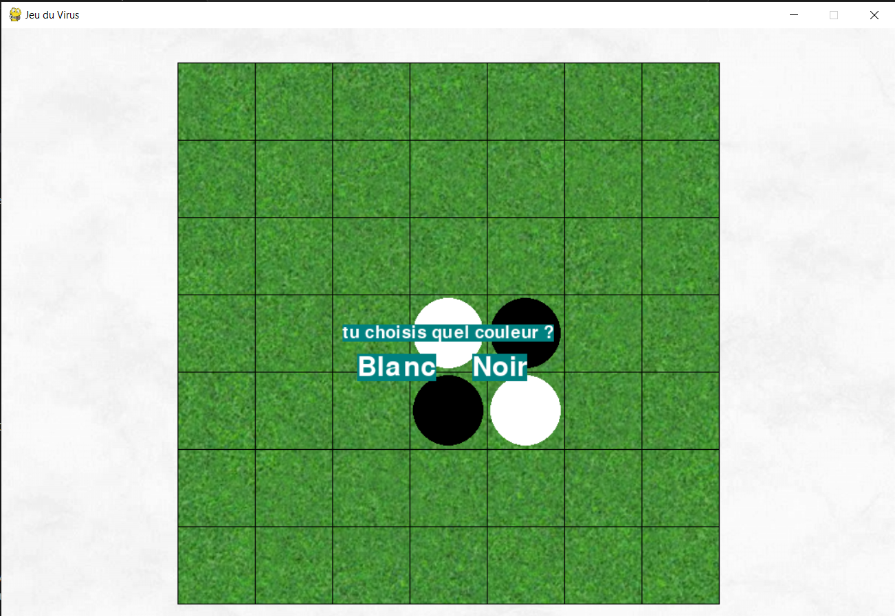

# Jeu du Virus – Jeu de Grille Multijoueur/IA

## 📌 Description
Jeu de stratégie développé en Python avec Pygame. Deux joueurs (ou un joueur contre une IA) s'affrontent pour **contaminer le plus de zones** sur une grille.

## 🚀 Fonctionnalités
- Jeu en local 1v1 ou contre l'ordinateur
- Propagation visuelle des zones "contaminées"
- Interface en 2D avec Pygame

## 🛠 Technologies
- Python
- Pygame

## 📸 Apercu
